# HEOS Core v1.0 — Entity-Relationship Diagram

Simplified ER. Standard `id`/`created_at`/`updated_at` omitted; only
domain-significant columns shown. Rendered as Mermaid.

```mermaid
erDiagram
    customers ||--o{ bookings : books
    customers ||--o{ guest_documents : has
    customers ||--o{ guest_reviews : leaves

    bookings ||--o{ booking_items : contains
    bookings ||--o{ booking_charges : has
    bookings ||--o{ booking_payments : receives
    bookings ||--o{ booking_room_assignments : occupies
    bookings ||--o{ booking_activities : logs
    bookings ||--o{ booking_tokens : issues
    bookings ||--o{ housekeeping_tasks : triggers
    bookings ||--o{ complaints : receives

    rooms ||--o{ booking_room_assignments : assigned
    rooms ||--o{ housekeeping_tasks : services
    rooms ||--o{ room_maintenance : blocked

    room_rates }o--|| rooms : rate_for
    rate_overrides }o--|| room_rates : overrides

    booking_payments ||--o{ booking_payment_activities : history
    booking_payments }o--|| razorpay_orders : settles

    housekeeping_tasks ||--o{ laundry_queue : produces
    laundry_queue }o--o{ laundry_batches : batched_into
    laundry_batches ||--o{ laundry_batch_lines : contains
    laundry_batches }o--|| vendors : sent_to
    laundry_batch_lines }o--|| linen_types : of

    cash_transactions ||--o{ cash_tx_activities : history
    cash_transactions }o--|| expense_types : categorised
    cash_audit_closes ||--o{ cash_audit_activities : history

    complaints ||--o{ complaint_activities : history
    complaints }o--|| complaint_categories : categorised

    profiles }o--|| user_roles : has
    user_roles }o--|| roles : is
    role_permissions }o--|| roles : grants
    role_permissions }o--|| permissions : of
    user_permission_overrides }o--|| permissions : overrides
    user_permission_overrides }o--|| profiles : for

    staff ||--o{ staff_attendance : logs
    staff ||--o{ salary_payments : paid
    staff ||--o{ salary_advances : advances
    staff ||--o{ staff_documents : has

    inventory_items ||--o{ inventory_movements : moves
    inventory_movements }o--|| vendors : from_or_to

    leads ||--o{ lead_activities : history
    external_bookings }o--|| bookings : linked_to
    razorpay_orders ||--o{ razorpay_webhook_events : receives

    night_audit_runs ||--o{ night_audit_sessions : logs
    night_audit_runs ||--o{ night_audit_decisions : records

    master_data ||..o{ bookings : lead_source
    master_data ||..o{ customers : tags
    charge_catalog ||..o{ booking_charges : catalogued
    hk_issue_types ||..o{ housekeeping_room_exceptions : reason

    activity_log }o..|| bookings : optional_link
    activity_log }o..|| customers : optional_link
    notifications }o..|| profiles : optional_recipient
    push_subscriptions }o--|| profiles : subscribes

    quotes ||--o{ quote_items : contains
    quotes ||--o{ quote_activities : history
    followups }o--|| quotes : follows_up
```



## Ownership notes

- **`bookings`** is the operational hub. Most write flows terminate here.
- **`customers`** is the CRM hub. Bookings link back for guest profile.
- **`rooms`** + **`room_rates`** are the inventory spine.
- **`activity_log`** is the universal audit spine (write-only from apps).
- **`master_data`** feeds most dropdowns; new categories require no
  schema change.
- **Deprecated cluster** (`quotes`, `quote_items`, `quote_activities`,
  `followups`) is retained read-only for historical audit; no live
  application code writes to it.

## Dependency levels (write flow)

```
Level 0 (foundations):   app_settings, roles, permissions, master_data
Level 1 (masters):       rooms, room_rates, customers, staff, vendors,
                         charge_catalog, hk_issue_types, linen_types,
                         expense_types, complaint_categories
Level 2 (operational):   bookings, booking_*, complaints, tasks,
                         housekeeping_tasks, laundry_queue,
                         laundry_batches, cash_transactions,
                         inventory_movements, staff_attendance,
                         salary_*
Level 3 (audit/log):     activity_log, *_activities, night_audit_*,
                         integration_runs, razorpay_webhook_events,
                         cash_audit_*
Level 4 (delivery):      notifications, crm_outbound_emails,
                         push_subscriptions
```

Migrations MUST respect these levels (lower first).
