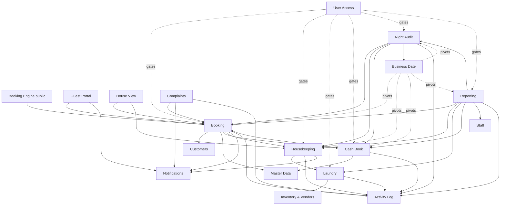

# HEOS Core v1.0 — Module Dependencies

How modules interact at runtime. Arrows point from **caller** to
**callee** or **emitter** to **consumer**.

## Ownership

- **Booking** owns booking lifecycle. Every module reads booking state;
  only Booking writes it.
- **Housekeeping** owns HK task lifecycle. Only the checkout hook
  (owned by Booking) enqueues tasks.
- **Laundry** consumes HK-completed rows via `laundry_queue`.
- **Cash Book** owns cash ledger; only Booking (via payments) and
  operators (via expenses) write.
- **Night Audit** is the only writer of Business Date (via
  `app_settings`).
- **Notifications** is fan-out only — never mutates business state.
- **Activity Log** is append-only. Every module writes; only Reporting
  reads.

## Forbidden couplings

The following couplings are architectural violations. Fix on sight.

1. Any screen writing to `housekeeping_tasks` outside `hk-*` engine.
2. Any screen advancing `business_date` outside Night Audit.
3. Any module sending push/email directly instead of via
   `notification-engine.ts`.
4. Any screen reading/writing deprecated `quotes*` / `followups`.
5. Cross-module joins in reporting that bypass `reporting/*` helpers.

## Real-time subscriptions

House View, Housekeeping, and Laundry subscribe to Supabase Realtime.
New realtime channels should be added via `use-realtime.ts` — do not
open raw channels from components.
